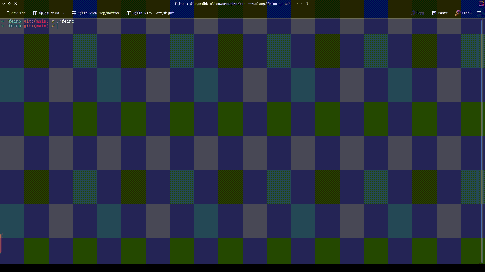

<p align="center">
  
</p>

# FEINO

> **⚠️ Not under active development.** FEINO was built as a learning project to explore how modern AI agents work — tool calling, the ReAct loop, multi-provider routing, security sandboxing — and was primarily exercised against a local [Ollama](https://ollama.com/) instance. It is unlikely to receive further development: the broader ecosystem already has mature agent frameworks (Claude Code, Codex, Gemini CLI, etc.) that cover this space more thoroughly. The code is kept public as a reference for anyone interested in the architecture or wanting to fork it.

**A Go AI agent CLI** — multi-provider, multi-UI, tool-calling agent with a terminal UI, a browser-based interface, and a headless REPL. One binary, three modes, zero vendor lock-in.

[](https://github.com/odinnordico/feino/actions/workflows/pr.yml)
[](https://github.com/odinnordico/feino/actions/workflows/test.yml)
[](https://github.com/odinnordico/feino/actions/workflows/codeql.yml)
[](https://github.com/odinnordico/feino/actions/workflows/release.yml)
[](https://go.dev)
[](LICENSE)
[](https://goreportcard.com/report/github.com/odinnordico/feino)

---

## Demo

### CLI mode



### Web mode


> **Generating GIFs:** Demo recordings are defined as [VHS](https://github.com/charmbracelet/vhs) tapes in [`demos/`](demos/). They are automatically re-rendered by [`charmbracelet/vhs-action`](.github/workflows/demos.yml) on every push that touches a `.tape` file and committed back to the repository. No API key is required — the tapes use [`cmd/demoserver`](cmd/demoserver/), a small binary that starts a sequential fake LLM server and runs feino against it. Trigger the first render via `workflow_dispatch` in the Actions tab.

---

## Table of Contents

- [Features at a glance](#features-at-a-glance)
- [Quick Start](#quick-start)
- [Modes of operation](#modes-of-operation)
- [Configuration reference](#configuration-reference)
- [Architecture overview](#architecture-overview)
- [Agent subsystem](#agent-subsystem)
  - [ReAct state machine](#react-state-machine)
  - [TACOS routing](#tacos-routing)
  - [Provider resilience](#provider-resilience)
- [Security model](#security-model)
  - [Permission levels](#permission-levels)
  - [Path allowlist](#path-allowlist)
  - [AST blacklist](#ast-blacklist)
- [Context assembly](#context-assembly)
  - [System prompt structure](#system-prompt-structure)
  - [Tree-sitter chunking](#tree-sitter-chunking)
  - [Skills](#skills)
- [Tool suite](#tool-suite)
  - [Native tools](#native-tools)
  - [Browser automation](#browser-automation)
  - [Plugin system](#plugin-system)
  - [MCP integration](#mcp-integration)
- [Memory system](#memory-system)
- [Credential storage](#credential-storage)
- [Web UI](#web-ui)
- [Terminal UI](#terminal-ui)
- [Development guide](#development-guide)
- [Extending FEINO](#extending-feino)
- [License](#license)

---

## Features at a glance

| Capability             | Details                                                                       |
| ---------------------- | ----------------------------------------------------------------------------- |
| **Multi-provider LLM** | Anthropic Claude, OpenAI, Google Gemini, Ollama, any OpenAI-compatible server |
| **TACOS routing**      | Latency-EMA + Z-score outlier detection selects optimal model per-turn        |
| **Three UIs**          | Bubble Tea TUI · React/Connect SPA · headless REPL                            |
| **Security gate**      | Permission level · path allowlist · Bash AST blacklist                        |
| **22 browser tools**   | CDP-based Chrome automation via a shared pool                                 |
| **Plugin system**      | Drop executable + JSON manifest in `~/.feino/plugins/`                        |
| **MCP support**        | Connect any Model Context Protocol server (stdio or SSE)                      |
| **Skills**             | Markdown workflow files the agent discovers and follows                       |
| **Persistent memory**  | Agent writes facts about you; injected into every prompt                      |
| **Circuit breaker**    | Per-provider failure isolation with exponential backoff                       |
| **Secure credentials** | OS keyring (Keychain / Secret Service / Windows CM) with AES-256-GCM fallback |
| **Streaming events**   | `EventPartReceived` → `EventComplete` pub/sub bus drives all UIs identically  |

---

## Quick Start

### Prerequisites

- Go 1.26+
- An API key for at least one supported provider, **or** a running Ollama instance

### Install from source

```bash
git clone https://github.com/odinnordico/feino
cd feino
go build -o feino ./cmd/feino
```

### First run

On the very first invocation with no credentials configured the **setup wizard** launches automatically:

```bash
./feino
```

The wizard walks through provider selection, API key entry (stored securely in the OS keyring), model selection with live fetch, working directory, and theme.

### Skip the wizard

```bash
# Anthropic
ANTHROPIC_API_KEY=sk-ant-... ./feino

# OpenAI
OPENAI_API_KEY=sk-... ./feino

# Google Gemini
GEMINI_API_KEY=AIza... ./feino

# Local Ollama (no key required)
./feino   # Ollama is auto-detected at http://localhost:11434
```

---

## Modes of operation

```
./feino                  # Terminal UI (default)
./feino --no-tui         # Plain stdin/stdout REPL
./feino --web            # Web server + React SPA
```

| Flag          | Default     | Description                                               |
| ------------- | ----------- | --------------------------------------------------------- |
| `--web`       | false       | Start the Connect RPC + React SPA server                  |
| `--web-host`  | `127.0.0.1` | Bind address for the web server                           |
| `--web-port`  | `7700`      | TCP port for the web server                               |
| `--no-tui`    | false       | Skip Bubble Tea; read from stdin, write to stdout         |
| `--log-level` | `info`      | Override log verbosity (`debug`\|`info`\|`warn`\|`error`) |

### TUI mode

Full-screen Bubble Tea application. Layout:

```
┌─ FEINO  claude-opus-4-7 ───────────────────────────────────────────────────┐
│────────────────────────────────────────────────────────────────────────────│
│  WORKSPACE (70%)                    │  THINKING (30%)                       │
│                                     │  ● act                                │
│  > What does the agent package do?  │                                       │
│                                     │                                       │
│  The agent package implements the   │                                       │
│  ReAct loop via a state machine…    │                                       │
│                                     │                                       │
├─────────────────────────────────────────────────────────────────────────────┤
│  >> ⠸ Type a message…                                                  87%  │
├─────────────────────────────────────────────────────────────────────────────┤
│  act | Latency: 312ms | Turn: 1p/2c | Tokens: 812p/1042c/1854 total        │
└─────────────────────────────────────────────────────────────────────────────┘
```

**Key bindings:**

| Key              | Action                                                                |
| ---------------- | --------------------------------------------------------------------- |
| `Enter`          | Submit message                                                        |
| `Ctrl+C` / `Esc` | Cancel in-flight turn                                                 |
| `Ctrl+T`         | Cycle theme (dark → light → auto)                                     |
| `PgUp / PgDn`    | Scroll workspace viewport                                             |
| `@path`          | Inline file attachment — expands to `<file path="...">content</file>` |
| `/setup`         | Re-open the setup wizard                                              |
| `/exit`          | Quit                                                                  |

### REPL mode

One message per line on stdin; responses on stdout. Ideal for CI, shell scripts, or headless containers.

```bash
echo "List all Go test files" | ./feino --no-tui

# Pipe a file for context
cat internal/agent/machine.go | ./feino --no-tui "Explain this file"
```

### Web mode

```bash
./feino --web --web-port 7700
# Open http://localhost:7700
```

Serves a React SPA over HTTP. The backend exposes a [Connect RPC](https://connectrpc.com/) service (`feino.v1.FeinoService`) with 28+ methods including a server-streaming `SendMessage` for real-time token delivery. All API keys are write-only — they are never returned in `GetConfig` responses.

---

## Configuration reference

Config lives at `~/.feino/config.yaml`. All values are optional; environment variables take precedence for provider API keys.

```yaml
providers:
  anthropic:
    api_key: sk-ant-... # or ANTHROPIC_API_KEY
    default_model: claude-opus-4-7

  openai:
    api_key: sk-... # or OPENAI_API_KEY
    base_url: https://api.openai.com/v1
    default_model: gpt-4o

  gemini:
    api_key: AIza... # or GEMINI_API_KEY
    default_model: gemini-2.0-flash
    vertex: false # set true + project_id for Vertex AI
    project_id: ""
    location: us-central1

  ollama:
    host: http://localhost:11434 # or OLLAMA_HOST
    default_model: llama3.2

  openai_compat: # vLLM, LocalAI, LM Studio, etc.
    base_url: http://localhost:8080/v1
    api_key: "" # optional
    name: localai # shown in UI
    default_model: mistral-7b
    disable_tools: false # some servers don't support function calling

agent:
  max_retries: 3
  high_complexity_threshold: 2000 # tokens; above this → intelligence tier
  low_complexity_threshold: 500 # tokens; below this → speed tier
  metrics_path: ~/.feino/metrics.json

security:
  permission_level: read # read | write | bash | danger_zone
  allowed_paths:
    - /home/user/projects
  enable_ast_blacklist: true

context:
  working_dir: "" # defaults to process cwd
  global_config_path: ~/.feino/config.md
  max_budget: 32000 # characters in the assembled system prompt
  plugins_dir: ~/.feino/plugins

mcp:
  servers:
    - name: filesystem
      transport: stdio
      command: npx
      args: ["-y", "@modelcontextprotocol/server-filesystem", "/tmp"]
    - name: my-sse-server
      transport: sse
      url: https://mcp.example.com/events

ui:
  theme: auto # dark | light | auto
  log_level: info
  language: "" # BCP 47 tag; empty = auto from $LANG

user:
  name: ""
  timezone: "" # IANA, e.g. America/Bogota
  communication_style: technical # concise | detailed | technical | friendly

services:
  email:
    enabled: false
    address: user@example.com
    imap_host: imap.example.com
    imap_port: 993
    smtp_host: smtp.example.com
    smtp_port: 587
    # credentials stored in OS keyring / encrypted file, not here
```

**Global instructions** — free-form Markdown at `~/.feino/config.md` — are appended to every system prompt across all sessions.

**Project instructions** — the context manager checks for `FEINO.md`, `GEMINI.md`, and `CLAUDE.md` in the working directory (in that order) and injects the first one found.

---

## Architecture overview

```
cmd/feino/main.go
│
├── tui.Run(cfg)           ← Bubble Tea full-screen UI
├── web.Run(cfg)           ← Connect RPC server + embedded React SPA
└── repl.Run(sess, …)      ← plain stdin/stdout loop
        │
        └── app.Session    ← UI-agnostic event bus (Send / Subscribe / Cancel)
                │
                └── agent.StateMachine    ← ReAct loop
                        │
                        ├── agent.TACOSRouter   ← optimal provider selection
                        ├── context.Manager     ← system prompt assembly
                        ├── security.Gate       ← permission enforcement
                        ├── tools.Tool[]        ← native + plugins + MCP
                        └── provider.Provider   ← LLM inference + resilience
```

All three UIs drive `app.Session` the same way:

1. Register event handler: `sess.Subscribe(func(e app.Event) { ... })`
2. Submit a turn: `sess.Send(ctx, userText)`
3. Receive a stream of typed events: `EventPartReceived`, `EventStateChanged`, `EventUsageUpdated`, `EventComplete`, `EventError`
4. Cancel at any time: `sess.Cancel()`

The TUI wires this as `sess.Subscribe(func(e) { prog.Send(chat.SessionEventMsg{e}) })`, forwarding every event as a Bubble Tea message.

---

## Agent subsystem

### ReAct state machine

`internal/agent/machine.go` implements the [ReAct](https://arxiv.org/abs/2210.03629) (Reason + Act) loop as an explicit state machine:

```
StateInit
  └─▶ StateGather   (build context, assemble tool list, fetch memories)
        └─▶ StateAct      (call LLM; execute any tool calls it requests)
              ├─▶ StateVerify   (validate tool results; retry up to MaxRetries)
              │     ├─▶ StateAct      (retry on bad result)
              │     └─▶ StateComplete (accept result)
              └─▶ StateFailed   (unrecoverable error)
```

Each state transition fires registered listeners **asynchronously** (`go l(newState)`), which is what allows the TUI to update the "THINKING" panel in real time without blocking the agent loop.

A **shared data map** passes structured data between phases (e.g., `gather` writes the assembled tool list; `act` reads it) without requiring a mutex — the state machine guarantees sequential phase execution.

### TACOS routing

**Token-Adjusted Cost-Optimised Selection** — `internal/agent/tacos.go`

TACOS maintains a rolling performance profile for every provider/model pair and routes each turn to the model that minimises latency for the estimated complexity.

#### Metrics

```
latency_per_token = response_time_ms / total_output_tokens
```

Stored as a fixed-capacity ring buffer of 50 samples per model, with:

- **EMA** (Exponential Moving Average, α = 0.3) — smoothed current performance
- **Variance / σ** — standard deviation over the window
- **Z-score** — `(current − mean) / σ` — how far the model is from its own baseline

Metrics are persisted to `~/.feino/metrics.json` after every 10 usages; entries inactive for 30 days are garbage-collected.

#### Routing algorithm

```
1. Estimate token count for the incoming turn (offline tokenizer)
2. Classify complexity:
     < 500 tokens  → Speed tier    (prefer fast, cheap models)
     500–2000      → Standard tier (neutral)
     > 2000 tokens → Intelligence tier (prefer powerful models)
3. Score each available model:
     base_score = EMA latency
     + tier adjustment  (−100 or +300 for Speed; −1500 or +500 for Intelligence)
     + 5000 if Z-score > 2.0  (outlier penalty)
     + 2000 if circuit breaker is HalfOpen
4. Return top-6 ranked recommendations
5. If no candidates pass: emergency probe with 3-second timeout
```

#### Configuration

```yaml
agent:
  low_complexity_threshold: 500 # tokens → Speed tier cutoff
  high_complexity_threshold: 2000 # tokens → Intelligence tier cutoff
  metrics_path: ~/.feino/metrics.json
```

### Provider resilience

`internal/provider/resilience.go` wraps every provider call with a circuit breaker and retry policy.

#### Circuit breaker

```
Closed ──(5 consecutive failures)──▶ Open
  ▲                                     │
  └──(probe succeeds)── HalfOpen ◀──(30s cooldown)
```

- **Closed**: requests pass through normally
- **Open**: requests fail immediately without hitting the API
- **HalfOpen**: one probe request allowed; success closes the breaker, failure re-opens it

#### Retry with exponential backoff + jitter

```
delay = min(initialDelay × 2^attempt − rand(delay/4), maxDelay)
```

Default config: 3 retries · 30s total timeout · 500ms initial delay · 4s max delay.

**Retryable:** network errors (`*net.OpError`, DNS, timeout, EOF, broken pipe), rate-limit responses (429), server errors (500/502/503/529).

**Non-retryable:** malformed requests, authentication failures — auth failures trigger a credential refresh via a `renewFn` callback before the next attempt.

---

## Security model

The security gate (`internal/security/`) applies three independent checks before any tool call executes. A turn can operate at most at the configured `permission_level` — there is no way to escalate without changing config.

### Permission levels

```
PermissionRead (0)  ≤  PermissionWrite (1)  ≤  PermissionBash (2)  ≤  PermissionDangerZone (3)
```

| Level         | What it allows                                                                     |
| ------------- | ---------------------------------------------------------------------------------- |
| `read`        | Non-mutating reads: `file_read`, `git_status`, `web_search`, `browser_navigate`, … |
| `write`       | + file mutations, `http_post`/`put`/`delete`, `browser_click`/`type`/`fill`, …     |
| `bash`        | + `shell_exec`, `browser_eval`, `browser_get_cookies`/`set_cookies`                |
| `danger_zone` | No restrictions; also bypasses path allowlist and AST blacklist                    |

**Lookup order** for a tool's required level:

1. Caller-supplied override map (highest priority)
2. Tool's own `Classified` interface (`PermissionLevel() int`)
3. Fallback to `PermissionDangerZone` for any unclassified tool

Default: `PermissionRead`. Every native tool declares its level explicitly via `WithPermissionLevel`.

**Bypass mode** — available in the web UI via the `/yolo` command or `SetBypassMode` RPC; elevates to `DangerZone` for a configurable duration (5 / 10 / 30 minutes or the whole session).

### Path allowlist

File and git tools resolve the `path` / `repo_path` parameter against the configured `allowed_paths` list before executing. A path is allowed if it equals a root or is a descendant:

```go
strings.HasPrefix(candidate, root+string(os.PathSeparator))
```

An empty `allowed_paths` list denies all filesystem access. The check uses **lexical resolution** — symlinks are not followed, preventing escape via `../` traversal.

**Path-sensitive tools:** `file_read`, `file_write`, `file_edit`, `list_files`, `git_status`, `git_log`, `git_diff`, `git_blame`.

### AST blacklist

Shell commands submitted to `shell_exec` are parsed at the Bash AST level using the [mvdan.cc/sh](https://github.com/mvdan/sh) tree-sitter backend. The walker traverses the full AST — including sub-shells, command substitutions, and pipelines — to find prohibited command names.

**Blocked unconditionally:**

```
Network:     curl  wget  nc  ncat  netcat  ssh  scp  sftp  rsync
             ftp  tftp  telnet  socat  nmap  dig  nslookup  host
             traceroute  tracepath

Destructive: shred  wipefs  mkfs  fdisk  parted  blkdiscard
```

**Blocked conditionally:**

| Command | Blocked when                                              |
| ------- | --------------------------------------------------------- |
| `rm`    | flags include both `-r`/`-R` (recursive) AND `-f` (force) |
| `dd`    | `of=` argument starts with `/dev/`                        |
| `chmod` | `-R` combined with `777`, `a+w`, or `o+w`                 |

Non-literal command invocations (e.g., `$cmd arg`) are skipped — feino does not attempt to resolve variables.

---

## Context assembly

### System prompt structure

`internal/context/manager.go` assembles the system prompt from multiple sources within a configurable `max_budget` (default 32 000 characters). The template renders sections in this order:

```
<identity>               — who feino is and what it can do
<operating_rules>        — reasoning and tool-use discipline
<tool_usage>             — how to call tools correctly
<safety_guardrails>      — what to refuse
<memory_policy>          — when to write/update memories
<environment>            — OS, shell, working directory, date/time
<user_profile>           — name, timezone, communication style (if configured)
<agent_memories>         — injected from internal/memory/ store
<global_instructions>    — from ~/.feino/config.md
<project_instructions>   — from FEINO.md / GEMINI.md / CLAUDE.md (first found)
<available_tools>        — name + description + JSON Schema per tool
<available_skills>       — discovered skill files
<codebase_context>       — semantic code chunks up to remaining budget
```

The manager first renders the prompt **without** codebase context to measure the fixed overhead, then fills the remaining budget greedily with code chunks.

### Tree-sitter chunking

`internal/context/chunker.go` parses Go source files with [tree-sitter](https://github.com/smacker/go-tree-sitter) to extract semantic units:

| AST node type          | What is captured                              |
| ---------------------- | --------------------------------------------- |
| `function_declaration` | Full function (or skeleton if > 12 000 chars) |
| `method_declaration`   | Full method with receiver                     |
| `type_declaration`     | Struct/interface/type definition              |

Immediately preceding doc comments are attached to the chunk. For other file types the chunker falls back to 50-line blocks labeled `filename:start-end`.

Each `SemanticChunk` carries:

```go
type SemanticChunk struct {
    Type      string   // "function_declaration" | "method_declaration" | "type_declaration" | "line_chunk"
    Name      string   // identifier parsed from AST
    Content   string   // full source text
    FilePath  string
    Language  string   // "go" | "plaintext"
    StartLine uint32
    EndLine   uint32
}
```

When the budget is exhausted a truncation notice is appended listing how many chunks were omitted.

### Skills

Skills are Markdown workflow files the agent can reference and follow. FEINO searches for them in the first directory that exists:

```
<working_dir>/.feino/skills/
<working_dir>/.claude/skills/
<working_dir>/.gemini/skills/
```

**Skill file format:**

```markdown
---
name: "run-tests"
description: "Run the test suite and report any failures"
parameters:
  - name: package
    type: string
    required: false
    description: "Go package path to test (default: ./...)"
---

1. Run `go test {{package | default "./..."}} -race -count=1`
2. If there are failures, read the relevant source files
3. Report a summary with pass/fail counts and any error messages
```

Skills are injected into the system prompt under `<available_skills>`. The agent invokes a skill by referencing its name and the parameter values come from the conversation context.

---

## Tool suite

### Native tools

All native tools are returned by `tools.NewNativeTools(logger)`. Each tool self-declares its permission level via `WithPermissionLevel`.

#### Shell

| Tool         | Level | Description                                               |
| ------------ | ----- | --------------------------------------------------------- |
| `shell_exec` | bash  | Execute a shell command; returns combined stdout + stderr |

#### Files

| Tool          | Level | Description                                                |
| ------------- | ----- | ---------------------------------------------------------- |
| `list_files`  | read  | Directory listing; optional recursive tree walk            |
| `file_read`   | read  | Read file contents (up to 1 MB)                            |
| `file_write`  | write | Atomic write via temp-file + rename                        |
| `file_edit`   | write | Pattern-based find-and-replace (up to 10 changes per call) |
| `file_search` | read  | Regex search across a directory tree                       |

#### Git

| Tool         | Level | Description                                          |
| ------------ | ----- | ---------------------------------------------------- |
| `git_status` | read  | Working tree status                                  |
| `git_log`    | read  | Commit history with optional range and format string |
| `git_diff`   | read  | Diff between refs or working tree                    |
| `git_blame`  | read  | Line-by-line commit annotations                      |

#### Web & HTTP

| Tool           | Level | Description                    |
| -------------- | ----- | ------------------------------ |
| `web_search`   | read  | Web search query               |
| `web_fetch`    | read  | Fetch URL, return text content |
| `http_request` | read  | HTTP GET with optional headers |
| `http_post`    | write | HTTP POST with JSON body       |
| `http_put`     | write | HTTP PUT                       |
| `http_delete`  | write | HTTP DELETE                    |

#### Data & system

| Tool               | Level | Description                       |
| ------------------ | ----- | --------------------------------- |
| `currency_rates`   | read  | Live exchange rates               |
| `currency_convert` | read  | Currency conversion               |
| `weather_current`  | read  | Current weather conditions        |
| `weather_forecast` | read  | 10-day weather forecast           |
| `sys_info`         | read  | CPU, memory, disk, OS information |
| `notify`           | read  | Desktop system notification       |

#### Memory (in-session)

| Tool            | Level | Description                  |
| --------------- | ----- | ---------------------------- |
| `memory_write`  | write | Create a new memory entry    |
| `memory_list`   | read  | List all entries by category |
| `memory_update` | write | Update an existing entry     |
| `memory_forget` | write | Delete an entry              |

### Browser automation

`tools.NewBrowserTools(logger, debugPort)` returns 22 tools that control a Chromium-based browser (Chrome, Chromium, Edge, Brave) over the [Chrome DevTools Protocol](https://chromedevtools.github.io/devtools-protocol/).

#### Connection strategy

On the first tool invocation the pool:

1. Probes `http://localhost:9222/json/version` — if a browser is already listening, **attaches to the first non-`chrome://` page tab** via WebSocket. Your existing session, cookies, and extensions remain intact.
2. If no browser is found, **launches a new Chromium process** using the user's own profile directory:
   - Linux: `~/.config/google-chrome`
   - macOS: `~/Library/Application Support/Google/Chrome`
   - Windows: `%LOCALAPPDATA%\Google\Chrome\User Data`

All 22 tools share the same pool and active-tab context. Stale connections are detected at call time and reconnected transparently before the operation retries once.

#### Attaching to an existing browser

```bash
google-chrome --remote-debugging-port=9222
# feino attaches automatically on the next browser tool call
```

#### Tool reference

| Tool                  | Level | Description                                                 |
| --------------------- | ----- | ----------------------------------------------------------- |
| `browser_navigate`    | read  | Navigate to URL; optional `wait_for` CSS selector           |
| `browser_back`        | read  | Go back in history                                          |
| `browser_forward`     | read  | Go forward in history                                       |
| `browser_reload`      | read  | Reload; `ignore_cache=true` for hard reload                 |
| `browser_click`       | write | Click by CSS selector or visible text                       |
| `browser_type`        | write | Type with real keyboard events (`clear_first` default true) |
| `browser_fill`        | write | Set input value directly (no key events)                    |
| `browser_select`      | write | Select `<select>` option by value or visible text           |
| `browser_key`         | write | Dispatch keyboard event (Enter, Tab, ArrowUp, …)            |
| `browser_hover`       | read  | Move real cursor via CDP + fire JS synthetic events         |
| `browser_screenshot`  | read  | Full-page or element screenshot; configurable `quality`     |
| `browser_get_text`    | read  | Visible text content of a selector (default `body`)         |
| `browser_get_html`    | read  | Outer HTML of a selector                                    |
| `browser_eval`        | bash  | Execute JavaScript; auto-awaits Promises                    |
| `browser_get_cookies` | bash  | List cookies; values redacted by default                    |
| `browser_set_cookies` | bash  | Inject or overwrite a cookie                                |
| `browser_wait`        | read  | Wait for selector to be `visible` / `ready` / `not_visible` |
| `browser_scroll`      | read  | Scroll element into view or by pixel offset                 |
| `browser_info`        | read  | Current URL, title, all open tabs                           |
| `browser_switch_tab`  | read  | Switch active tab by ID or `title_contains`                 |
| `browser_new_tab`     | read  | Open a new tab at a URL                                     |
| `browser_close_tab`   | read  | Close tab by ID or close the current tab                    |

#### Concurrency safety

The pool uses a **three-phase lock protocol** for operations that create new tab contexts (`browser_new_tab`, `browser_switch_tab`):

1. Acquire lock → snapshot `allocCtx` + generation counter → release lock
2. Create new CDP context **outside** the lock (network I/O)
3. Re-acquire lock → verify generation counter unchanged → swap contexts

This prevents a long-running tab creation from blocking other tool calls while preserving correctness if the pool reconnects mid-operation. The HTTP probe in `ensureConnected` also releases the mutex during the network call (`/json/version`), then re-checks connection state after reacquiring.

### Plugin system

Drop an executable and a JSON manifest into `~/.feino/plugins/` (or the path set in `context.plugins_dir`):

```
~/.feino/plugins/
├── my_tool          ← executable (any language; must have the execute bit)
└── my_tool.json     ← manifest
```

**Manifest:**

```json
{
  "name": "my_tool",
  "description": "Does something useful",
  "permission_level": "read",
  "parameters": {
    "type": "object",
    "properties": {
      "input": { "type": "string", "description": "Input text" }
    },
    "required": ["input"]
  },
  "timeout_seconds": 30
}
```

`permission_level` must be one of: `read` · `write` · `bash` · `danger_zone`.

**Protocol — stdin/stdout JSON:**

```
stdin  → {"input": "hello"}
stdout → {"content": "processed: hello"}               ← success
stdout → {"content": "error details", "is_error": true} ← failure
```

Non-JSON stdout is treated as plain-text success content. Stderr is appended to the error message on non-zero exit. Plugins that exceed `timeout_seconds` are killed with SIGTERM.

**Loading:**

```go
pluginTools, err := tools.LoadPlugins(pluginsDir, logger)
```

### MCP integration

FEINO acts as an MCP **client** — it can connect to any [Model Context Protocol](https://modelcontextprotocol.io/) server and expose its tools, resources, and prompts to the agent.

**Two transports:**

| Transport | Config fields            | Description                                                 |
| --------- | ------------------------ | ----------------------------------------------------------- |
| `stdio`   | `command`, `args`, `env` | Spawns subprocess; newline-delimited JSON over stdin/stdout |
| `sse`     | `url`                    | HTTP Server-Sent Events; persistent streaming connection    |

**Configuration:**

```yaml
mcp:
  servers:
    - name: filesystem
      transport: stdio
      command: npx
      args:
        ["-y", "@modelcontextprotocol/server-filesystem", "/home/user/projects"]
    - name: github
      transport: stdio
      command: npx
      args: ["-y", "@modelcontextprotocol/server-github"]
      env:
        GITHUB_PERSONAL_ACCESS_TOKEN: "ghp_..."
    - name: remote
      transport: sse
      url: https://mcp.example.com/events
```

Each MCP tool is wrapped in a `mcpToolAdapter` that implements the `tools.Tool` interface — so MCP tools go through the same security gate as native tools.

---

## Memory system

`internal/memory/` implements a persistent key-value store that lets the agent remember facts about the user and environment across sessions.

**Categories:**

| Category     | Purpose                                                   |
| ------------ | --------------------------------------------------------- |
| `profile`    | Identity facts (name, timezone, pronouns)                 |
| `preference` | Behavioural preferences (communication style, editor)     |
| `fact`       | Discovered environment facts (OS, shell, project details) |
| `note`       | Free-form agent notes                                     |

**Storage:** JSON at `~/.feino/memory.json`. Atomic writes via temp-file + rename. Thread-safe via `sync.RWMutex`.

**Entry schema:**

```json
{
  "id": "a3f2e1b0",
  "category": "preference",
  "content": "Prefers bullet-point summaries over prose",
  "created_at": "2026-04-23T14:00:00Z",
  "updated_at": "2026-04-23T14:00:00Z"
}
```

**Search** is a case-insensitive substring match over `content + category`.

At the start of every turn, `FormatPrompt()` injects all entries into the system prompt:

```
[profile] Name: Diego
[preference] Prefers bullet-point summaries over prose
[fact] OS: Linux 6.19 / shell: zsh
```

The agent can create, update, and delete memories using the `memory_write` / `memory_update` / `memory_forget` tools.

---

## Credential storage

`internal/credentials/` abstracts secure secret storage with automatic backend selection:

| Backend            | When used                                   | Where stored                                          |
| ------------------ | ------------------------------------------- | ----------------------------------------------------- |
| **OS keyring**     | macOS / Linux with Secret Service / Windows | Keychain · GNOME Keyring · Windows Credential Manager |
| **Encrypted file** | Fallback when keyring unavailable           | `~/.feino/credentials.enc`                            |

The keyring is probed on startup with a 2-second timeout. If the probe fails or times out, the encrypted-file backend is used transparently.

**Encrypted-file backend:**

- AES-256-GCM encryption
- Key derived from machine ID via **HKDF-SHA256** (no passphrase required for normal use)
- Override key via `FEINO_CREDENTIALS_KEY` (base64-encoded 32 bytes) — required in CI, Docker, or multi-user environments where the machine ID is unstable
- Atomic writes (temp-file + rename); file mode `0600`
- In-memory read cache behind `sync.RWMutex`

**Namespace:** secrets are stored as `service / key` pairs:

```
"anthropic" / "api_key"      → sk-ant-...
"gmail"     / "access_token" → ya29.xxx
```

---

## Web UI

The React SPA lives in `internal/web/ui/` and is embedded into the binary at build time with `-tags web`.

**Tech stack:**

| Layer     | Library                                            |
| --------- | -------------------------------------------------- |
| Framework | React 18 + TypeScript                              |
| Build     | Vite 6                                             |
| Styling   | Tailwind CSS 4 + tailwind-merge                    |
| State     | Zustand 5                                          |
| Routing   | React Router 6                                     |
| Markdown  | react-markdown 9 + remark-gfm + rehype-highlight   |
| Charts    | Recharts 2                                         |
| RPC       | Connect Web 2 (buf.build)                          |
| Protocol  | Protobuf + Connect RPC over HTTP/2 cleartext (h2c) |

**Key views:**

- `ChatView` — streaming chat, tool call cards, permission approval modal
- `HistoryView` — replay past turns with full tool traces
- `ProfilePage` / `MemoryManager` — view and edit persistent memories
- `ConfigYamlModal` — live config editor (API keys write-only)
- `ThemeModal` / `LangModal` — UI preferences

**Event stream** — `SendMessage` is a server-streaming RPC. The client opens a long-lived HTTP/2 stream and receives typed `AgentEvent` messages:

```
PartReceivedEvent     → stream token to chat viewport
ThoughtReceivedEvent  → update "THINKING" panel
ToolCallEvent         → show tool call card with name + args
ToolResultEvent       → attach result to card; highlight errors
StateChangedEvent     → update state badge (gather / act / verify / complete)
UsageUpdatedEvent     → update token counter
PermissionRequestEvent → show approval modal
CompleteEvent         → finalise message, enable input
ErrorEvent            → show error toast
```

**Development:**

```bash
# Backend (Go, no embedded assets)
go build -o feino ./cmd/feino
./feino --web --web-port 7700

# Frontend dev server (Vite, proxies /feino.v1.* to :7700)
cd internal/web/ui
npm install
npm run dev        # http://localhost:5173

# Type check
npm run typecheck

# Tests
npm test -- --run --passWithNoTests

# Production build (embeds into binary)
npm run build
go build -tags web -o feino ./cmd/feino
```

---

## Terminal UI

Built with [Bubble Tea](https://github.com/charmbracelet/bubbletea). Entry point: `tui.Run(cfg)`.

**Key patterns:**

- `handleResize()` and `cycleTheme()` return `(Model, tea.Cmd)` — because `Update` has a value receiver, helpers that only return `tea.Cmd` silently discard all mutations.
- `View()` ends with `return m.zm.Scan(combined)` — single [`bubblezone`](https://github.com/lrstanley/bubblezone) scan at root to keep mouse-zone tracking correct.
- Streaming: `PartReceivedMsg` calls `m.vp.SetContent(…) + m.vp.GotoBottom()` on every chunk for real-time display.
- `flushPendingChunk()` is called on `CompleteMsg` to glamour-render the full response and commit it to `m.messages`.
- The [glamour](https://github.com/charmbracelet/glamour) Markdown renderer is created once in `handleResize()` and on theme change — never per message.
- `/setup` re-entry: `tea.ExitAltScreen` → blocking `wizard.Run` in a `tea.Cmd` closure → `tea.EnterAltScreen`.

**Themes:** Catppuccin Mocha (dark) and Catppuccin Latte (light), with `auto` deferring to `lipgloss.HasDarkBackground()`.

---

## Development guide

```bash
# Build (fast, no embedded assets)
go build -o feino ./cmd/feino

# Build with debug info (disables inlining + optimisation)
go build -gcflags="all=-N -l" -o feino ./cmd/feino

# Build with embedded frontend
make web                           # npm ci + tsc + vite build
go build -tags web -o feino ./cmd/feino

# Tests
go test ./...                      # all packages
go test -race ./...                # with race detector
go test ./internal/agent/... -run TestStateMachine  # specific test

# Code quality
go vet ./...
goimports -w $(find . -name '*.go' -not -path './gen/*')
staticcheck ./...

# Regenerate protobuf
buf generate                       # requires buf CLI

# Frontend
cd internal/web/ui
npm run dev                            # Vite dev server (proxy to :7700)
npm run typecheck                      # tsc --noEmit
npm test -- --run --passWithNoTests    # vitest
npm run build                          # production build

# All-in-one CI check
make ci                                # proto + web + test-race + lint + build
```

---

## Extending FEINO

### Add a new LLM provider

1. Implement `internal/provider/provider.go:Provider`:
   ```go
   type Provider interface {
       GetModels(ctx context.Context) ([]string, error)
       SetModel(model string) error
       Infer(ctx context.Context, req InferRequest) (<-chan InferEvent, error)
   }
   ```
2. Add a `Tier` constant in `internal/agent/tacos.go` if it needs custom routing behaviour.
3. Wire it into `app.New` in `internal/app/session.go`.
4. Add config fields to `internal/config/config.go`.

### Add a new native tool

```go
// internal/tools/mytools.go
func NewMyTools(logger *slog.Logger) []Tool {
    return []Tool{
        NewTool(
            "my_tool",
            "Does something useful",
            map[string]any{
                "type": "object",
                "properties": map[string]any{
                    "input": map[string]any{"type": "string"},
                },
                "required": []string{"input"},
            },
            func(params map[string]any) ToolResult {
                input, _ := params["input"].(string)
                return NewToolResult("result: "+input, nil)
            },
            WithPermissionLevel(PermLevelRead),
            WithLogger(logger),
        ),
    }
}
```

Register in `internal/tools/native.go`:

```go
all = append(all, NewMyTools(logger)...)
```

### Add a new browser tool

```go
func newBrowserMyTool(pool *browserPool, logger *slog.Logger) Tool {
    return NewTool("browser_my_tool", "…", schema,
        func(params map[string]any) ToolResult {
            if err := pool.runDefault(chromedp.ActionFunc(func(ctx context.Context) error {
                // CDP actions here
                return nil
            })); err != nil {
                return NewToolResult("", err)
            }
            return NewToolResult("done", nil)
        },
        WithPermissionLevel(PermLevelRead),
        WithLogger(logger),
    )
}
```

Register it in the `NewBrowserTools` return slice.

### Add a new web API endpoint

1. Add the RPC to `proto/feino/v1/feino.proto`.
2. Regenerate: `buf generate`.
3. Implement the handler in `internal/web/handler.go`.
4. Add the corresponding React hook in `internal/web/ui/src/hooks/`.

### Add a skill

Create `<project>/.feino/skills/<name>.md` with YAML frontmatter (see [Skills](#skills) above). No code changes needed — FEINO discovers skill files at startup.

### Add a plugin (no Go required)

```bash
cat > ~/.feino/plugins/jira_search.json <<'EOF'
{
  "name": "jira_search",
  "description": "Search Jira issues by JQL",
  "permission_level": "read",
  "parameters": {
    "type": "object",
    "properties": {
      "jql": { "type": "string", "description": "JQL query string" }
    },
    "required": ["jql"]
  },
  "timeout_seconds": 15
}
EOF

cat > ~/.feino/plugins/jira_search <<'EOF'
#!/usr/bin/env python3
import sys, json, subprocess
params = json.load(sys.stdin)
result = subprocess.run(
    ["jira", "issue", "list", "--jql", params["jql"]],
    capture_output=True, text=True
)
print(json.dumps({"content": result.stdout or result.stderr}))
EOF

chmod +x ~/.feino/plugins/jira_search
```

---

## License

See [LICENSE](LICENSE) in the repository root.
